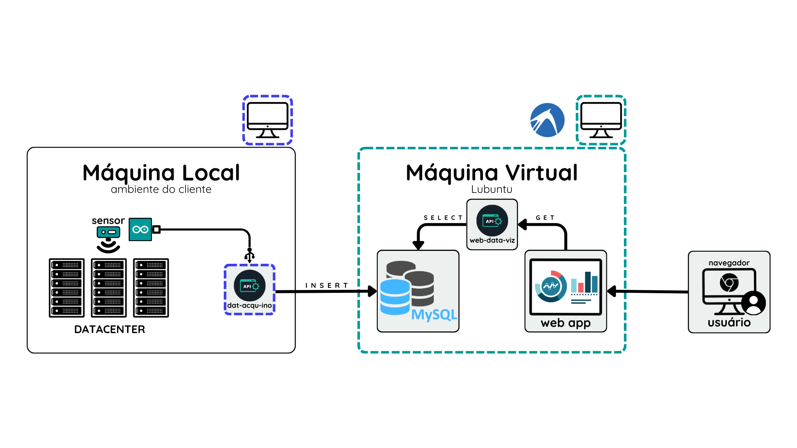

## Introdução

Bem-vindo ao manual de instalação do sistema de monitoramento de umidade e temperatura da DataTech. Este guia fornecerá instruções detalhadas para a instalação correta e segura do seu equipamento.

## Ferramentas Necessárias

- Chave de fenda
- Furadeira
- Parafusos e buchas
- Fita isolante
- Máquina para configuração inicial

## Instruções de Segurança

- Leia todas as instruções antes de iniciar a instalação.
- Certifique-se de que a área de instalação esteja livre de obstruções.

## Passo a Passo da Instalação

### 1. Preparação do Local

- Escolha um local adequado para a instalação dos sensores.
- Marque os pontos de fixação dos sensores no local de instalação.

### 2. Instalação dos Sensores

- Perfure os pontos marcados e insira as buchas.
- Fixe os sensores utilizando os parafusos fornecidos.
- Conecte os sensores ao sistema de monitoramento conforme o diagrama.

### 3. Conexão ao Sistema de Monitoramento

- Conecte o sensor ao arduino.
- Conecte o cabo USB à maquina usada para configuração.
- Verifique as conexões com o banco de dados e a API.

### 4. Configuração do Sistema

- Inicie o Node.js e siga as instruções na tela para configurar os parâmetros de umidade e temperatura.
- Realize testes para garantir que os sensores estão funcionando corretamente.

### 5. Finalização

- Fixe o cabo de forma organizada utilizando fita isolante.
- Verifique novamente todas as conexões e configurações.
- O sistema está pronto para uso.

## Suporte Técnico

Para qualquer dúvida ou problema durante a instalação, entre em contato com o suporte técnico:

- Telefone: (11) 3456-7890
- Email: [datatech@gmail.com.br](mailto:datatech@gmail.com.br)
- Website: [DataTech](https://www.datatech.com/)

---
